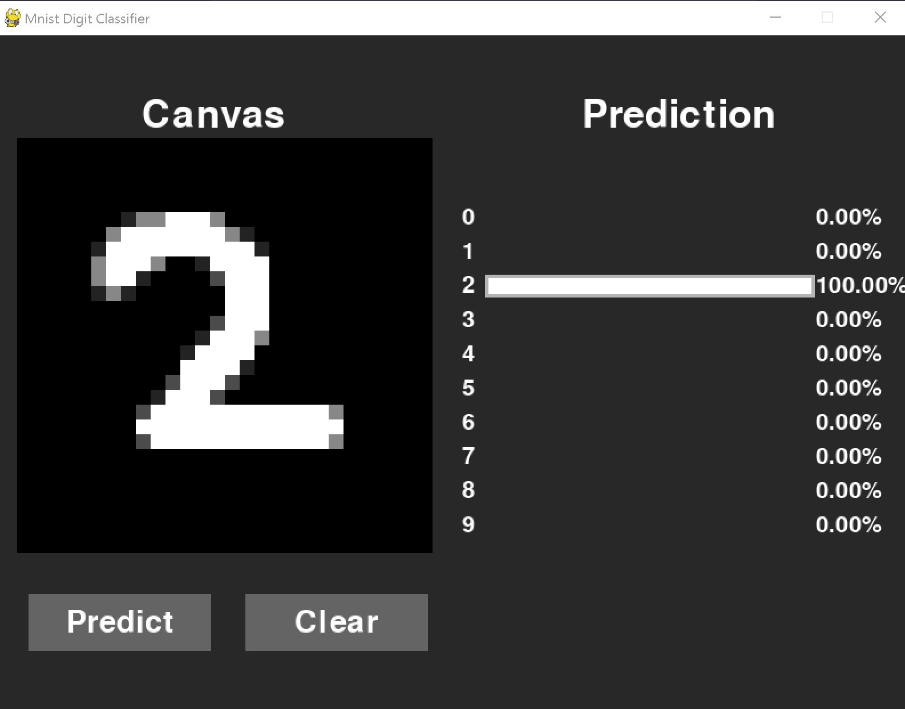

# MNIST Digit Classifier ✍️

## Overview 🔍
Welcome to this fun and interactive digit recognition project! 👋 

Ever wondered how computers can read handwritten numbers? This project lets you draw digits and watch artificial intelligence in action as it recognizes them in real-time. Built with the beginner-friendly `pygame` library for a smooth drawing experience, it uses a powerful `tensorflow/keras` model trained on the famous MNIST dataset to make predictions. Whether you're learning about AI or just want to play around with machine learning, this project is perfect for you! Check out the [model details](#technical-specifications) if you're curious about the technical stuff.

## Features ⭐
- Real-time digit recognition 🔄
- Interactive drawing interface 🎨
- Pre-trained neural network model 🧠
- Support for custom model integration 🔧

## Prerequisites 📋
- Python 3.9 and higher 🐍
- pip package manager 📦

## Installation 💻

1. Clone the repository:
```bash
git clone https://github.com/veer-golechha/mnist_digit_classifier.git
cd mnist_digit_classifier
```

2. Install dependencies:
```bash
pip install -r requirements.txt
```

## Usage 🚀

Launch the application:
```bash
python main.py
```

## Custom Model Integration 🛠️

To use your own classification model:

1. Place your model file in the project root directory:
```
mnist_digit_classifier/
├── elements.py
├── input_widget.py
├── main.py
├── model_.py
├── output_widget.py
└── your_model.h5
```

2. Update the model path in `model_.py`:
```python
model_path = "./your_model.h5"
```

## Technical Specifications

### Model Architecture 🏗️
- Type: `Sequential` Neural Network
- Input Shape: `(784, )`
- Output Shape: `(1, 10)`

### Model Configuration ⚙️
- Loss Function: `categorical_crossentropy`
- Optimizer: `adam`

### Layer Architecture 📊
| Layer (type) | Output Shape | Parameters | Activation |
|--------------|--------------|------------|------------|
| dense        | (None, 128)  | 100,480    | ReLU       |
| dense_1      | (None, 128)  | 16,512     | ReLU       |
| dropout      | (None, 128)  | 0          | -          |
| dense_2      | (None, 10)   | 1,290      | Softmax    |

Total Parameters: 118,282 (462.04 KB)
- Trainable Parameters: 118,282
- Non-trainable Parameters: 0

## Screenshot 📸
